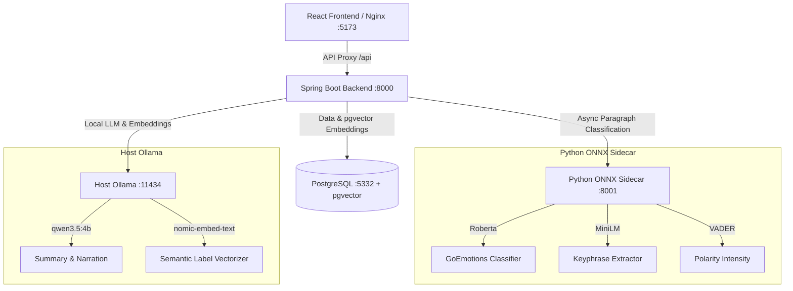

# Cognalytix

### AI-Powered Self-Discovery Journal & Growth-Insight Platform

**Cognalytix** is an introspective journaling platform that turns personal reflections into structured self-discovery cards. By analyzing journal text at both paragraph and entry levels, it maps long-term emotional patterns, detects growth shifts, and narrates what it finds—helping users realize: *"I never noticed that about myself."*

---

## The Problem Cognalytix Solves

Traditional journaling tools are static logs; they record thoughts but do not help you find patterns. Modern AI solutions often send entire journals directly to LLMs, which is slow, expensive, and leads to fragmented vocabularies (e.g. creating different labels for "work stress", "office tension", and "job strain"). 

Cognalytix solves this using a **hybrid SQL + dual-AI strategy**:
1. **Local Classification Sidecar**: Extracts raw, structured keyphrases and emotions per paragraph on CPU using fast, quantized ONNX models in milliseconds.
2. **Semantic pgvector Deduplication**: Uses cosine similarity to match extracted tags against the user's existing vocabulary, reusing labels when similarity is $\ge 0.75$ to keep tag lists clean and consistent.
3. **Generative Mirror Narration**: Aggregates history using PostgreSQL queries and uses a local LLM to translate those facts into structured growth reflections ("Mirror Cards").

---

## Project Structure

The codebase is split into modular components:

| Directory | Description |
|---|---|
| [**`source/`**](file:///home/lightdesk/Downloads/Projects/Cognalytix/source/) | Spring Boot 4 backend orchestrating REST APIs, async AI analysis, and pgvector storage. |
| [**`sidecar/`**](file:///home/lightdesk/Downloads/Projects/Cognalytix/sidecar/) | Python FastAPI service running Roberta (GoEmotions) & MiniLM models via ONNX. |
| [**`frontend/`**](file:///home/lightdesk/Downloads/Projects/Cognalytix/frontend/) | React 19 single-page app styled with custom warm paper palettes and serif display typography. |
| [**`docker/`**](file:///home/lightdesk/Downloads/Projects/Cognalytix/docker/) | Custom PostgreSQL 16 image with pgvector pre-installed and health checks. |
| [**`scripts/`**](file:///home/lightdesk/Downloads/Projects/Cognalytix/scripts/) | Automated stack verification and lifecycle integration demo script. |

---

## System Architecture

Cognalytix runs a containerized service mesh accessing a native host-level instance of Ollama to leverage GPU hardware acceleration.



---

## Documentation System

Explore the dedicated docs directory for topic-specific guides:

- 🚀 [**Getting Started**](file:///home/lightdesk/Downloads/Projects/Cognalytix/docs/getting-started.md): Installation, quick start, local developer setup, and port mappings.
- ⚙️ [**System Architecture**](file:///home/lightdesk/Downloads/Projects/Cognalytix/docs/architecture.md): The dual-AI engine breakdown, semantic label selectors, and pattern narration.
- 🔌 [**API Reference**](file:///home/lightdesk/Downloads/Projects/Cognalytix/docs/api.md): REST endpoints, JSON payloads, pagination, and admin functions.
- 🗄️ [**Database Schema**](file:///home/lightdesk/Downloads/Projects/Cognalytix/docs/database.md): Schema tables, pgvector index settings, JSONB shapes, and migrations.
- 🔧 [**Troubleshooting**](file:///home/lightdesk/Downloads/Projects/Cognalytix/docs/troubleshooting.md): IDE compile fixes, connection timeouts, and missing model errors.

---

## Quick Start (Docker)

To run the entire system in containerized mode:

1. **Pull required models** in your host Ollama instance:
   ```bash
   ollama pull qwen3.5:4b
   ollama pull nomic-embed-text
   ollama pull qwen3.5:0.8b
   ```
2. **Start the stack** via Docker Compose:
   ```bash
   docker compose up -d
   ```
3. **Verify the services** are healthy:
   ```bash
   docker compose ps
   ```
4. **Access the application**:
   - Frontend SPA: **`http://localhost:5173`**
   - REST API: **`http://localhost:8000`**

---

## Running the Automated Demo

The repository includes a self-contained shell script that verifies the entire API and processing lifecycle. It performs real HTTP calls, runs ONNX segmentation, calls Ollama, matches labels semantically in PostgreSQL, and outputs growth results.

Run the script:
```bash
./scripts/demo.sh
```

---

## License

Private repository. All rights reserved.
