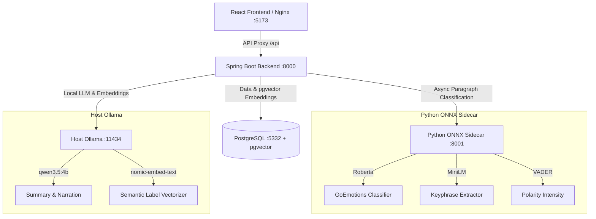

# Cognalytix

### AI-Powered Self-Discovery Journal & Growth-Insight Engine

**Cognalytix** is the core backend services and AI orchestration engine that turns personal journal entries into structured self-discovery cards. It processes raw journal text, detects emotional patterns across topic families using a local classification sidecar, semantically deduplicates user vocabulary via PostgreSQL `pgvector`, and narrates growth trends using localized LLMs.

---

## Key Features

- **Dual-AI Architecture**: Leverages local ONNX models for sub-second paragraph classification and Ollama chat models for high-level insight synthesis and narration.
- **Semantic Vocabulary Matching**: Utilizes `nomic-embed-text` and PostgreSQL `pgvector` to identify and reuse semantically similar user labels ($\ge 0.75$ cosine similarity), preventing tag duplication.
- **Explainable Trajectories**: Combines SQL-first statistical aggregation with LLM natural language generation to explain emotional shifts.
- **Tabular Data Export**: Offers a flat, paginated JSON export of journal sections for analytics tools (e.g., Power BI).

---

## System Architecture

The service mesh operates as a containerized stack that connects to a native host-level instance of Ollama to leverage GPU hardware acceleration.



---

## Documentation System

Explore the following guides for detailed implementation and setup:

- 🚀 [**Getting Started Guide**](docs/getting-started.md): Installation steps, host Ollama prep, local development, and port mappings.
- ⚙️ [**System Architecture**](docs/architecture.md): The Dual-AI engine division of labor, label matching, and mirror narration.
- 🔌 [**API Reference**](docs/api.md): Complete REST endpoint documentation, request/response bodies, and authentication controls.
- 🗄️ [**Database Schema**](docs/database.md): Schema entity details, pgvector index definitions, JSONB shapes, and migrations.
- 🔧 [**Troubleshooting Guide**](docs/troubleshooting.md): Compile fixes, network connection resolutions, and cold-start warmup settings.

---

## Quick Start (Docker)

To run the backend alongside its database and ONNX sidecar:

1. **Pull required models** on host Ollama:
   ```bash
   ollama pull qwen3.5:4b
   ollama pull nomic-embed-text
   ollama pull qwen3.5:0.8b
   ```
2. **Start backend and infrastructure**:
   Ensure you run the Docker compose from the repository root (parent folder):
   ```bash
   docker compose up -d postgres sidecar backend
   ```
3. **Verify backend health**:
   ```bash
   curl -sf http://localhost:8000/actuator/health
   ```

---

## License

Private repository. All rights reserved.
