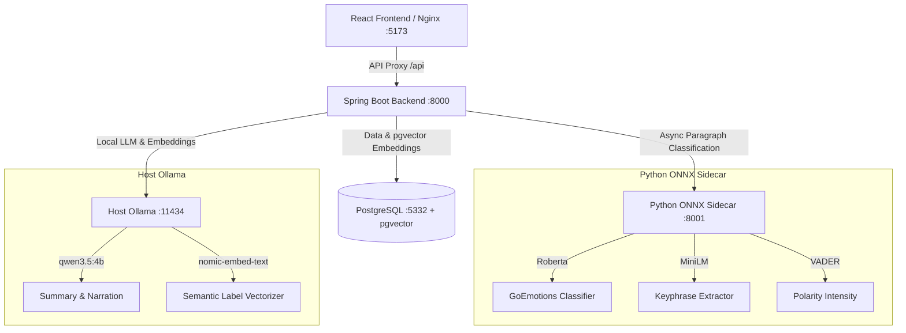

# System Architecture

Cognalytix utilizes a **Dual-AI Engine Strategy** designed to balance speed, cost, and analytical depth. By splitting duties between lightweight local classification models and a localized generative LLM, it achieves sub-second text categorization while retaining deep, empathetic synthesis.

---

## High-Level Architecture

The containerized stack communicates across a bridged Docker network (`cognalytix-net`), accessing the host-level Ollama instance for heavy LLM and embedding workloads.



---

## The Dual-AI Engine Strategy


*Visual representation of the Dual-AI processing engine: Structured local classification (left) combined with generative narration (right).*

### 1. The Fast Local ONNX Sidecar (Python FastAPI)
Running small, quantized models locally on CPU, the sidecar segments journal entries by paragraph and extracts structured features for each block in a single call.

- **Emotion Classification**: Uses a quantized **Roberta GoEmotions** ONNX model to classify paragraphs into one of 28 fine-grained emotion labels (e.g. `caring`, `confusion`, `remorse`).
- **Topic Extraction**: Employs a **MiniLM** sentence-transformer ONNX model. It extracts noun-phrase candidate words, runs them and the paragraph through MiniLM to get 384-dimensional embeddings, and matches the candidate with the highest cosine similarity to the paragraph.
- **Intensity Scoring**: Employs **VADER Sentiment** polarity analysis to map emotional intensity into a 1–5 range based on the compound valence score.

### 2. The Deep Generative LLM (Spring AI + host Ollama)
Freed from classification work, the backend utilizes `qwen3.5:4b` only for orchestration and qualitative synthesis.

- **Reflections & Coping Tips**: Generates a 2–3 sentence warm reflection. If the entry's overall intensity is $\ge 4$, it appends a concrete coping tip.
- **Mirror Card Narration**: Translates SQL-derived pattern shift facts into structured 5-field mirror cards.

---

## Semantic Label Selection & pgvector Deduplication

To avoid a fragmented vocabulary (e.g. creating separate labels for "stress", "stresser", "stressed out"), Cognalytix routes extracted topics and emotions through a **vector similarity matching step**:

```
[Sidecar Extracts "deadline"]
         │
         ▼
[Backend Generates 1024-dim Vector via Ollama]
         │
         ▼
[PostgreSQL pgvector Cosine Distance Query]
         │
   ┌─────┴─────────────────────────────────────┐
   │ Similarity >= 0.75?                       │
   ├───────────────────┬───────────────────────┤
   │ YES               │ NO                    │
   ▼                   ▼                       │
[Reuse Existing     [Create New User Label     │
 User Label]         & Store Embedding Async]  │
```

1. **Embedding**: The backend embeds the sidecar-extracted raw label string using `nomic-embed-text` (1024 dimensions).
2. **Similarity Search**: Performs a cosine similarity search against the user's existing `topic_label_embeddings` or `emotion_label_embeddings` tables.
3. **Decision**:
   - If similarity is **$\ge 0.75$**, the matching saved label is reused.
   - Otherwise, the new label is persisted, and its embedding is stored asynchronously via `EmbeddingStorageService`.

---

## Label Family Clustering

Synonymous labels are clustered into families (e.g. "job deadline" and "work pressure" $\rightarrow$ `work_stress`). 
- When a new label is created, `FamilyResolutionService` fires a prompt to the LLM to resolve a common family key.
- This allows SQL-based pattern tracking to aggregate data across related topics without hardcoded taxonomy rules.

---

## Pattern Analysis & Mirror Narration

The **Post-Entry Mirror Card** generation follows a strict "SQL Detects, AI Narrates" philosophy to ensure accuracy:

1. **SQL Aggregation**: `PatternAnalysisService` runs standard SQL aggregates across the user's past journal history. It calculates metrics like average emotional intensity, prior dominant emotion families, and entry count.
2. **Direction Classification**: `EmotionDriftFacts` evaluates the data against hardcoded drift thresholds to determine a trajectory: `GROWTH`, `REGRESSION`, or `STABLE`.
3. **Narration Prompting**: The structured facts and the calculated direction are injected into an LLM prompt. The LLM is instructed to generate a 5-field mirror card matching the exact structure and tone rules.

---

## Next Steps

- Consult the [Database Schema Guide](file:///home/lightdesk/Downloads/Projects/Cognalytix/docs/database.md) to inspect vector columns and table definitions.
- Go to [Getting Started](file:///home/lightdesk/Downloads/Projects/Cognalytix/docs/getting-started.md) to set up and run the system.
