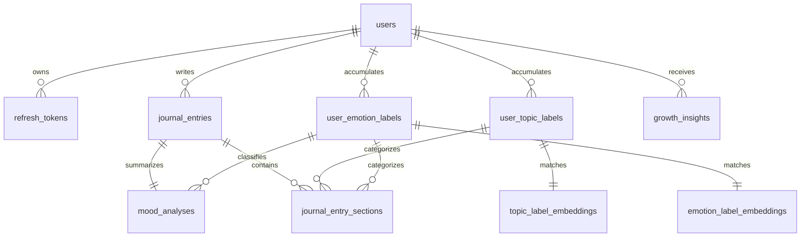

# Database Schema

Cognalytix uses **PostgreSQL 16** enhanced by the **`pgvector`** extension for semantic vector similarity queries. Flyway manages schema migrations.

---

## 1. Schema Diagram & Relationships

The database is structured around the core entities of users, journal entries, and classifications:



---

## 2. Table Definitions

### `users`
Stores user profile credentials, access roles, and status flags.
- `id` (UUID, Primary Key)
- `name` (VARCHAR)
- `email` (VARCHAR, Unique)
- `password_hash` (VARCHAR) — `BCrypt(SHA-256(password + pepper))`
- `role` (VARCHAR) — `USER`, `ADMIN`
- `is_active` (BOOLEAN) — Blocked logins when `false`

### `refresh_tokens`
Tracks active, HMAC-hashed user refresh tokens. Supports token rotation.
- `id` (UUID, Primary Key)
- `user_id` (UUID, Foreign Key $\rightarrow$ `users.id`)
- `token_hash` (VARCHAR) — HMAC-SHA256 signature of the opaque refresh token
- `expires_at` (TIMESTAMP)

### `journal_entries`
Stores raw entry text and tracks background processing state.
- `id` (UUID, Primary Key)
- `user_id` (UUID, Foreign Key $\rightarrow$ `users.id`)
- `title` (VARCHAR)
- `content` (TEXT)
- `word_count` (INTEGER)
- `analysis_status` (VARCHAR) — `PENDING`, `DONE`, `FAILED`
- `analysis_attempt_count` (INTEGER) — Increments on worker start
- `analysis_fail_count` (INTEGER) — Increments when worker errors
- `analysis_in_progress` (BOOLEAN) — Active job lock
- `last_analysis_error` (VARCHAR) — Error code (e.g. `llm_unreachable`)
- `entry_date` (TIMESTAMP)

### `mood_analyses`
Synthesizes the overall emotional tone and insight for a single entry.
- `id` (UUID, Primary Key)
- `entry_id` (UUID, Foreign Key $\rightarrow$ `journal_entries.id`, Unique)
- `mood_label` (VARCHAR) — Display label
- `aggregate_emotion_label_id` (UUID, Foreign Key $\rightarrow$ `user_emotion_labels.id`)
- `intensity` (INTEGER) — 1–5 overall score
- `insight` (TEXT) — LLM narrative summary
- `coping_tip` (TEXT) — Suggested tip (present if intensity $\ge 4$)
- `themes` (JSONB) — String array of theme tags (e.g., `["work", "timeline"]`)

### `journal_entry_sections`
Individual paragraphs segmented and annotated by the classification engine.
- `id` (UUID, Primary Key)
- `entry_id` (UUID, Foreign Key $\rightarrow$ `journal_entries.id`)
- `sort_order` (INTEGER) — Sort order inside entry
- `topic_label_id` (UUID, Foreign Key $\rightarrow$ `user_topic_labels.id`)
- `emotion_label_id` (UUID, Foreign Key $\rightarrow$ `user_emotion_labels.id`)
- `content` (TEXT) — Raw paragraph excerpt
- `intensity` (INTEGER) — 1–5 paragraph score

### `user_topic_labels` & `user_emotion_labels`
Per-user vocabulary collections containing hierarchical taxonomy data.
- `id` (UUID, Primary Key)
- `user_id` (UUID, Foreign Key $\rightarrow$ `users.id`)
- `label` (VARCHAR) — Raw display string
- `normalized_key` (VARCHAR) — Case and space normalized key
- `family_key` (VARCHAR) — Grouping key resolved by LLM
- `label_data` (JSONB) — Hierarchical structure (see section below)

### `topic_label_embeddings` & `emotion_label_embeddings`
Stores the dense vector representations of user labels.
- `id` (UUID, Primary Key)
- `label_id` (UUID, Foreign Key)
- `user_id` (UUID, Foreign Key $\rightarrow$ `users.id`)
- `embedding` (VECTOR(1024)) — 1024-dimension vector embedding generated by `nomic-embed-text`

### `growth_insights`
Stores self-discovery mirror cards and SQL-aggregated facts.
- `id` (UUID, Primary Key)
- `user_id` (UUID, Foreign Key $\rightarrow$ `users.id`)
- `insight_type` (VARCHAR) — e.g. `POST_ENTRY`
- `trigger_entry_id` (UUID, Foreign Key $\rightarrow$ `journal_entries.id`)
- `topic_family` (VARCHAR)
- `emotion_family` (VARCHAR)
- `pattern_type` (VARCHAR) — e.g. `EMOTION_DRIFT_ON_TOPIC_FAMILY`
- `direction` (VARCHAR) — `GROWTH`, `REGRESSION`, `STABLE`
- `narration` (TEXT) — JSON string mapping to the 5-field mirror card
- `pattern_data` (JSONB) — Underlying SQL metrics (prior/current intensities, frequencies)

---

## 3. pgvector Configuration

The database defines 1024-dimension vector columns matching `nomic-embed-text` output dimensions. 

### Vector Indexing
Cosine similarity searches are optimized using **HNSW (Hierarchical Navigable Small World)** indexes on the embedding columns. This ensures fast $K$-Nearest Neighbor searches as a user's vocabulary grows:

```sql
CREATE INDEX ON topic_label_embeddings 
USING hnsw (embedding vector_cosine_ops);

CREATE INDEX ON emotion_label_embeddings 
USING hnsw (embedding vector_cosine_ops);
```

### Query Structure
The `SemanticLabelSelector` checks similarity via cosine distance (`<=>` operator):
```sql
SELECT label_id, (1 - (embedding <=> :queryEmbedding)) AS similarity
FROM topic_label_embeddings
WHERE user_id = :userId
ORDER BY embedding <=> :queryEmbedding ASC
LIMIT 1;
```

---

## 4. `label_data` JSONB Schema

To support structured queries and taxonomy trees, the user vocabulary tables contain a GIN-indexed `label_data` JSONB field matching this shape:

```json
{
  "display": "feeling overwhelmed",
  "category": "emotion",
  "topic": "work stress",
  "detail": "overwhelm"
}
```

### Querying Hierarchies
Because a GIN index is applied, you can query specific nested properties efficiently:
```sql
-- Retrieve all emotion labels related to the 'work stress' topic
SELECT * FROM user_emotion_labels 
WHERE label_data @> '{"topic": "work stress"}';
```

---

## 5. Flyway Migration History

Database changes are managed sequentially in `src/main/resources/db/migration/`:

| Migration | Version Description | Focus |
|---|---|---|
| **`V1`** | `V1__init_users_and_tokens.sql` | Basic user records and refresh token columns |
| **`V2`** | `V2__add_role_check.sql` | Adds constraints to secure roles (`USER` vs `ADMIN`) |
| **`V3`** | `V3__hash_refresh_tokens.sql` | Converts database refresh tokens to secure HMAC hashes |
| **`V4`** | `V4__create_journal_entries.sql` | Creates journal entity and processing status fields |
| **`V5`** | `V5__create_mood_analyses.sql` | Creates entry-level summary reflections and theme arrays |
| **`V6`** | `V6__create_security_settings.sql`| Singleton table for storing password pepper |
| **`V7`** | `V7__create_vocabularies_and_sections.sql`| Splits journal paragraphs into section references |
| **`V8`** | `V8__add_families_and_insights.sql`| Creates growth insights tables and family resolution keys |
| **`V9`** | `V9__add_insight_pattern_type.sql`| Adds metadata classification to trajectory records |
| **`V10`** | `V10__add_label_jsonb_metadata.sql`| Adds `label_data` JSONB column for taxonomy hierarchy |
| **`V11`** | `V11__add_pgvector_embeddings.sql`| Creates `vector(1024)` embedding tables |
| **`V12`** | `V12__create_label_backfill.sql`| Schema to track LLM-based metadata backfills |
